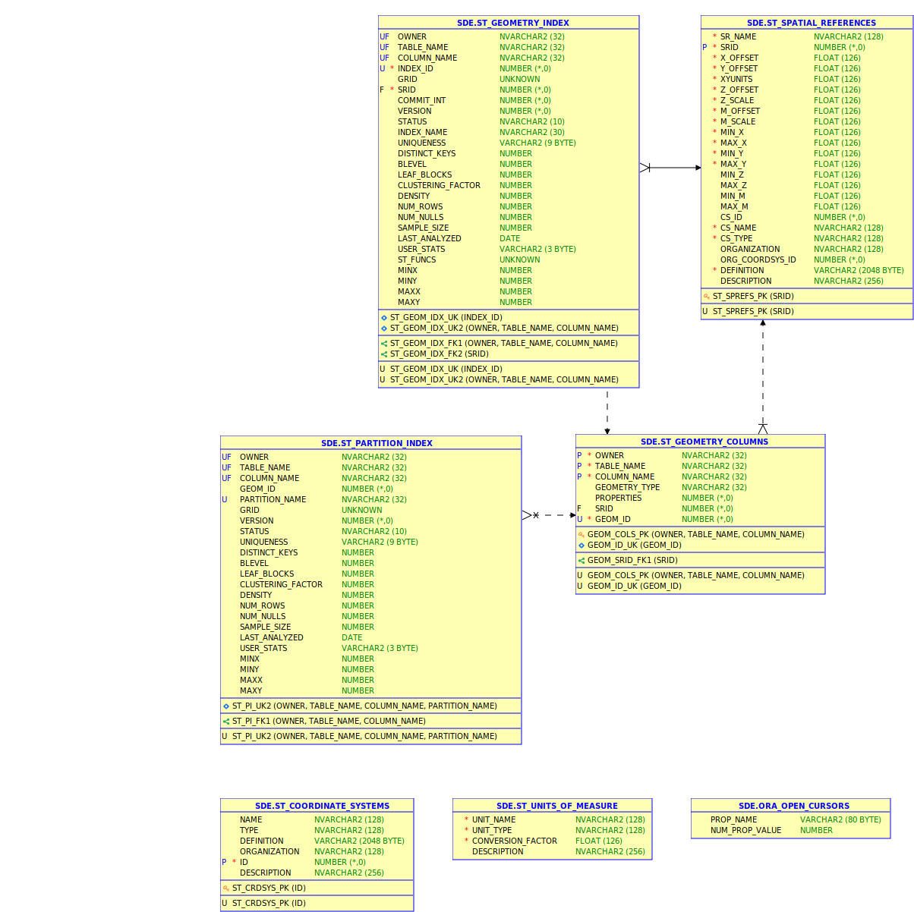

The Esri spatial type has been developed in order to allow direct access to geometries and geometric operations in various RDBMSs via SQL. This is a great way for the GIS and non-GIS world to use the same tables in a shared database.

Traditionally the tables in an enterprise geodatabase should not be used directly by SQL (except if you know what you are doing, of course, or you only access [simple non-versioned feature classes](https://desktop.arcgis.com/en/arcmap/latest/manage-data/using-sql-with-gdbs/workflow-using-sql-with-existing-feature-classes.htm)). 

With a minimal setup the Esri ST_Geometry type can be [installed in a database](https://desktop.arcgis.com/en/arcmap/latest/manage-data/databases/add-the-st-geometry-type-to-an-oracle-database.htm) which comes with a set of stored procedures, triggers and a few tables. This is a relatively small subset of the full enterprise geodatabase schema.

In order to use spatial tables created with a ST_Geometry column in ArcGIS clients (as query layers), a [few rules must be followed](https://desktop.arcgis.com/en/arcmap/latest/manage-data/using-sql-with-gdbs/rules-for-creating-spatial-tables-to-be-used-with-arcgis.htm). The general documentation is really good and useful. In oracle the ST_Geometry column is automatically registered in the ST_GEOMETRY_COLUMNS table if a [spatial index is created](https://desktop.arcgis.com/en/arcmap/latest/manage-data/using-sql-with-gdbs/create-spatial-indexes-on-tables-with-an-st-geometry-column.htm). So the only difficult thing is to find the appropriate SRID from ST_SPATIAL_REFERENCES or even inserting [your own spatial reference](https://desktop.arcgis.com/en/arcmap/latest/manage-data/using-sql-with-gdbs/create-spatial-references-using-sql.htm) in the range above 300000. Interestingly, whatever SRID is inserted by the insert-statement a trigger sets the actual SRID using one of the sequences. This mechanism ensures that the user-defined SRIDs always start at 300000.

What is missing on the internet is a documentation of all the tables that make up the schema of the ST_Geometry type (which is a subset of the metadata tables in a geodatabase). So here it is:

A few notes on some of these tables:

**[ST_GEOMETRY_INDEX](https://support.esri.com/en/technical-article/000009201)**: Metadata on the domain index for fast spatial querying. A spatial index consists of an index-organized table of the following naming convention S<index_id>_IDX$ where <index_id> references the respective entry in the ST_GEOMETRY_INDEX table. [Spatial index tuning](https://desktop.arcgis.com/en/arcmap/latest/manage-data/using-sql-with-gdbs/guidelines-to-choose-spatial-index-grid-size.htm) is highly underrated and a lot more difficult since the old SDE command line tools with its powerful sdelayer -o si_stats command have left us.

**ST_SPATIAL_REFERENCES** have been discussed above.

**ST_GEOMETRY_COLUMNS** contains metadata for the geometry fields such as the geometry type. In oracle, the shape columns are automatically registered (by some trigger) when a spatial index is created.

**ST_PARTITION_INDEX** strictly for people who know what they are doing (I don't know of anybody using this).

**ORA_OPEN_CURSORS** is relevant if you experience random crashes of the client application. Setting [verbose for the direct connect log](https://esriaustraliatechblog.wordpress.com/2016/09/22/faq-how-do-you-turn-on-verbose-logging-when-connecting-to-an-enterprise-geodatabase/) can give a hint by showing the *wrong* OPEN_CURSORS initialization parameter (e.g. SGA_Param - Open_Cursors: 300 instead the actual 2000). Apparently, the connected user cannot see the oracle initialization parameter and therefore it has to be "cached" in this table. For some reason, the geodatabase wants to know before ORA-01000 would happen so it can crash the process preemptively (or at least this happened at 10.5)! Therefore after changing the OPEN_CURSORS parameter in oracle (e.g. to the recommended 2000), the stored procedure [sde.gdb_util.update_open_cursors](https://desktop.arcgis.com/en/arcmap/latest/manage-data/gdbs-in-oracle/update-open-cursors.htm) must be run as it states in the documentation. Otherwise one might end up with a multi-month headache due to seemingly random crashes in the production database!

